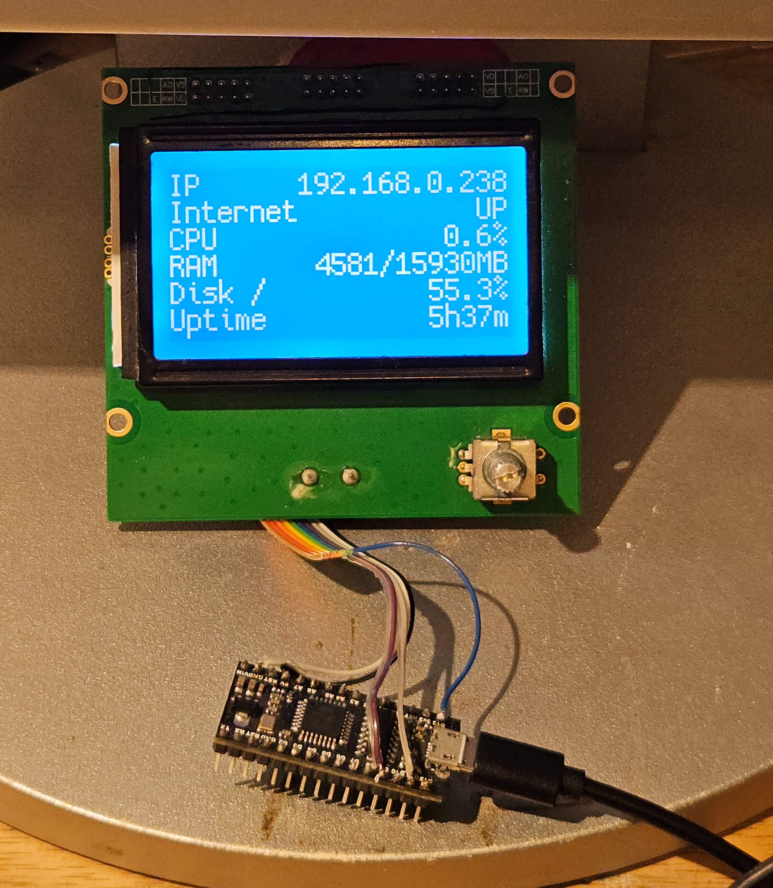

# ender3-lcd-python

Repurpose the Ender 3 LCD (ST7920 128x64) as a general-purpose system info display, driven by a host computer over USB serial.



## Architecture

```
Host (Python) ──USB Serial──> ATmega328P ──SPI──> ST7920 128x64 LCD
```

The host renders a 1bpp framebuffer and streams it to the microcontroller, which forwards it to the display. The two communicate at 115200 baud using a simple sync-word framing protocol.

## Protocol

Each frame is prefixed with a 2-byte sync word (`0xA5 0x5A`) followed by 1024 bytes of raw framebuffer data (128×64 / 8). The firmware responds with `FRAME_OK\n` once the frame is committed to the display.

## Firmware (`src/main.cpp`)

Runs on an **ATmega328P** (Arduino Nano), built with PlatformIO.

- Waits for the sync word on the serial port, then reads 1024 bytes directly into the U8g2 display buffer
- On a complete frame, calls `u8g2.sendBuffer()` to push it to the ST7920 over hardware SPI and replies `FRAME_OK`
- On startup, displays a "Host disconnected" message until the first frame arrives

**Dependencies:** [U8g2](https://github.com/olikraus/u8g2) (`olikraus/U8g2`)

### Build & Flash

```bash
pio run --target upload
```

## Python (`python/`)

Runs on the host. Renders system info using Pillow and streams frames over serial.

**Files:**
- `main.py` — main loop, serial handling, system info rendering
- `framebuffer.py` — `FrameBuffer` class for 1bpp pixel manipulation

**Dependencies:**

```bash
pip install pyserial pillow psutil
```

### Usage

```bash
python python/main.py --port /dev/ttyUSB0
```

The script displays:

| Field    | Description              |
|----------|--------------------------|
| IP       | Local IP address         |
| Internet | Connectivity check       |
| CPU      | CPU usage %              |
| RAM      | Used / total RAM in MB   |
| Disk /   | Root filesystem usage %  |
| Uptime   | System uptime            |

Frames are sent every second. The script retries the serial connection automatically if the device is unplugged, and handles `SIGTERM` cleanly for use as a systemd service.

### Running as a systemd service

```ini
[Unit]
Description=Ender3 LCD display daemon
After=network.target

[Service]
ExecStart=/usr/bin/python3 /path/to/python/main.py --port /dev/ttyUSB0
Restart=on-failure

[Install]
WantedBy=multi-user.target
```
